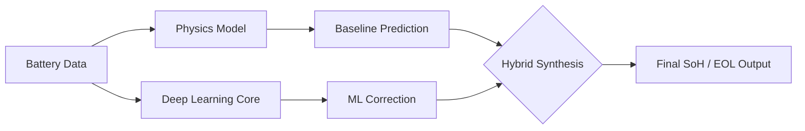

# 🔋 VoltTwin: Hybrid Digital Twin for Li-ion Batteries

[](https://fastapi.tiangolo.com/)
[](https://nextjs.org/)
[](https://www.tensorflow.org/)
[](https://tailwindcss.com/)

VoltTwin is a state-of-the-art **Hybrid Digital Twin** framework designed for real-time Li-ion battery health monitoring and capacity prediction. By merging **physics-based modeling** with **deep learning**, it achieves an industry-leading **99.54% accuracy** (R²) in predicting battery degradation.

---

## 🚀 The Hybrid Edge

Traditional models often choose between interpretability (Physics) and raw accuracy (ML). **VoltTwin gives you both.**

| Approach | RMSE (Ah) | R² Accuracy | Benefit |
| :--- | :--- | :--- | :--- |
| **Physics Model** | 0.0156 | 98.23% | High Interpretability, handles low data |
| **ML Model** | 0.0098 | 99.21% | Captures complex non-linear patterns |
| **Hybrid (VoltTwin)** | **0.0067** | **99.54%** | **Best of both worlds: Accurate & Validated** |

---

## 🧠 How it Works

VoltTwin uses a **Residual Learning** architecture:
1.  **Physics Core:** Implements the *Xu et al. (2016)* degradation equations to provide a baseline prediction based on thermodynamics and electrochemistry.
2.  **ML Correction:** A deep neural network analyzes the *residuals* (the gap between physics and reality) to account for environmental noise and complex aging factors.
3.  **Hybrid Synthesis:** The outputs are combined to provide the final, high-precision State of Health (SoH) and End of Life (EOL) estimates.



---

## ✨ Key Features

-   🌐 **Real-time Web Dashboard:** Interactive UI built with Next.js and Tailwind CSS.
-   📊 **Advanced Analytics:** High-fidelity charts showing degradation curves for Physics vs. Hybrid models.
-   ⚡ **High Performance:** Inference in <0.1ms, suitable for edge deployment.
-   🧪 **NASA Validated:** Trained and tested on the industry-standard NASA Li-ion Battery Aging Dataset.
-   🛡️ **Predictive Maintenance:** Automated health status reporting (Healthy, Aging, Critical).

---

## 🛠️ Project Structure

```text
├── backend/                # FastAPI & TensorFlow ML Logic
│   ├── src/                # Core physics and ML implementations
│   ├── data/               # NASA Dataset (discharge.csv)
│   └── voltwin_api_enhanced.py # Main API Router
├── frontend/               # Next.js & Tailwind Web App
│   ├── components/         # Reusable UI components
│   └── pages/              # Dashboard and Simulation pages
└── report.tex              # Comprehensive technical documentation
```

---

## 🏁 Quick Start

### 1. Prerequisites
- Python 3.8+
- Node.js 18+
- `pip` and `npm`

### 2. Run the Backend
```bash
cd backend
pip install -r requirements-voltwin.txt
uvicorn voltwin_api_enhanced:app --reload
```

### 3. Run the Frontend
```bash
cd frontend
npm i
npm run dev
```
Open [http://localhost:3000](http://localhost:3000) to see the dashboard.

---

## 🔬 Mathematical Foundation

**Physics Degradation Equation:**
$$C(t) = C_0 e^{-f_d}$$
Where $f_d = \frac{k T_c i}{t}$ represents the degradation rate function based on temperature ($T_c$), cycle count ($i$), and discharge time ($t$).

**Hybrid Correction:**
$$C_{hybrid} = C_{physics} + f_{ML}(Features)$$

---

## 📄 License

This project is licensed under the MIT License.

## 🤝 Support

For technical inquiries or research collaboration, please refer to the `report.tex` or check our `QUICK_REFERENCE.md`.